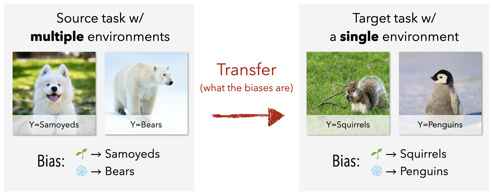

# Tofu

Code and data for [Learning Stable Classifiers by Transferring Unstable Features](https://proceedings.mlr.press/v162/bao22a.html) ICML 2022



If you like this work and use it on your own research, please cite our paper.

```
@inproceedings{bao2022learning,
  title={Learning Stable Classifiers by Transferring Unstable Features},
  author={Bao, Yujia and Chang, Shiyu and Barzilay, Regina},
  booktitle={International Conference on Machine Learning},
  pages={1483--1507},
  year={2022},
  organization={PMLR}
}
```


## Get started
**Setup [conda](https://docs.conda.io/en/latest/)**
1. Create a new conda environment with the required dependencies
`conda env create --file environment.yml`
2. Activate the environment `conda activate tofu`

**Download the datasets**
+ You can download the datasets by running the script `bin/download_data.sh`. All datasets will be downloaded under `datasets/`

**Run some experiments**
+ `bin/beer.sh` transfer from aspect look to aspect aroma
+ `bin/ask2me.sh` transfer from task penetrance to task incidence
+ `bin/bird.sh` transfer from seabird to waterbird
+ `bin/mnist.sh` transfer from even to odd
+ `bin/celeba.sh` transfer from eyeglasses to blond hair

## Acknowledgements

Research was sponsored by the United States Air Force Research Laboratory and the United States Air Force Artificial Intelligence Accelerator and was accomplished under Cooperative Agreement Number FA8750-19-2-1000. The views and conclusions contained in this document are those of the authors and should not be interpreted as representing the official policies, either expressed or implied, of the United States Air Force or the U.S. Government. The U.S. Government is authorized to reproduce and distribute reprints for Government purposes notwithstanding any copyright notation herein.

🌈 This paper is dedicated to the memory of our beloved family member [Tofu](https://people.csail.mit.edu/yujia/samoyed/), who filled our lives with so many wuffs and wuvs.

```                                                                     
TTTTTTTTTTTTTTTTTTTTTTT                 ffffffffffffffff                    
T:::::::::::::::::::::T                f::::::::::::::::f                   
T:::::::::::::::::::::T               f::::::::::::::::::f                  
T:::::TT:::::::TT:::::T               f::::::fffffff:::::f                  
TTTTTT  T:::::T  TTTTTTooooooooooo    f:::::f       ffffffuuuuuu    uuuuuu  
        T:::::T      oo:::::::::::oo  f:::::f             u::::u    u::::u  
        T:::::T     o:::::::::::::::of:::::::ffffff       u::::u    u::::u  
        T:::::T     o:::::ooooo:::::of::::::::::::f       u::::u    u::::u  
        T:::::T     o::::o     o::::of::::::::::::f       u::::u    u::::u  
        T:::::T     o::::o     o::::of:::::::ffffff       u::::u    u::::u  
        T:::::T     o::::o     o::::o f:::::f             u::::u    u::::u  
        T:::::T     o::::o     o::::o f:::::f             u:::::uuuu:::::u  
      TT:::::::TT   o:::::ooooo:::::of:::::::f            u:::::::::::::::uu
      T:::::::::T   o:::::::::::::::of:::::::f             u:::::::::::::::u
      T:::::::::T    oo:::::::::::oo f:::::::f              uu::::::::uu:::u
      TTTTTTTTTTT      ooooooooooo   fffffffff                uuuuuuuu  uuuu
```
